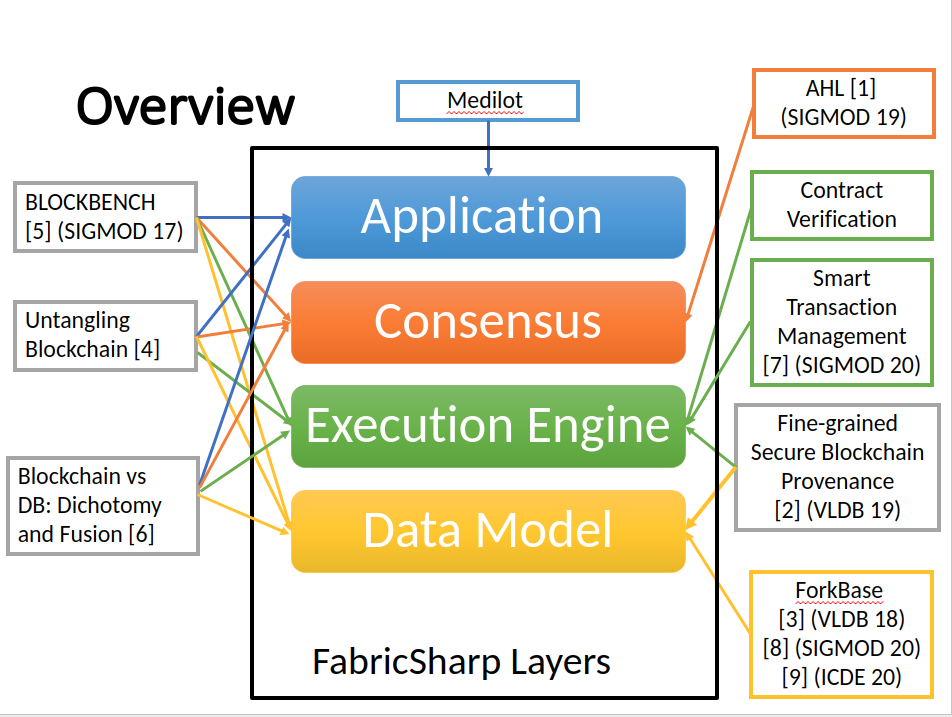

# Overview
FabricSharp (hash)  project is a variant of Hyperledger Fabric 1.4, a permissioned blockchain platform from Hyperledger. 
Compared with the vanilla version, FabricSharp supports fine-grained secure data provenance, sharding, smart transaction management, use of
trusted hardware (eg. SGX), and a blockchain native storage engine called ForkBase, to boost system performance.

Thanks to colleagues from [MediLOT](https://medilot.com), [NUS](https://www.comp.nus.edu.sg/~dbsystem/index.html), [SUTD](https://istd.sutd.edu.sg/people/faculty/dinh-tien-tuan-anh), [BIT](http://cs.bit.edu.cn/szdw/jsml/js/zmh/index.htm), [Zhejiang University](https://person.zju.edu.cn/0098112), [MZH Technologies](http://www.mzhtechnologies.com/) and other organizations for their contributions.

# Quick Start
* Build the chaincode environment
```
make ccenv # Will build an image hyperledger/fabric-ccenv:forkbase
```
* Build the peer docker image
```
DOCKER_DYNAMIC_LINK=true make peer-docker # Will build an image hyperledger/fabric-peer:forkbase
```

* Build the orderer docker image
```
make orderer-docker
```

__NOTE__: FabricSharp relies on ForkBase[3] as the storage engine, which is close-sourced.
Hence FabricSharp can only be built and run within the docker container. Running `make peer` may fail.  
__NOTE__: Always start the peer container with the following environment variable to enable for the above-built chaincode environment. `CORE_CHAINCODE_BUILDER=hyperledger/fabric-ccenv:forkbase`

# Architecture


# Progress
The current master branch incorporates the optimization from [2] and [7] on the basis of Fabric v1.4.2. 
We dedicate another branch __vldb19__, which shows more details only about [2], including the experimental baseline, scripts, chaincode examples and so on. 
Similarly, branch __sigmod20__ is dedicated for [7]. 
Refer to branch __vldb19__ on how to write provenance-dependent smart contracts, and __sigmod20__ for the snapshot-based transaction management. 

We will soon merge the optimization in [1] to this master branch upon v1.4.2 and similarly dedicate another branch for [1]. 

# Old readme 
[old_readme](README.old.md)

# Papers. 
* [1] H. Dang, A. Dinh, D. Lohgin, E.-C. Chang, Q. Lin, B.C. Ooi: [Towards Scaling Blockchain Systems via Sharding](https://arxiv.org/pdf/1804.00399.pdf). ACM SIGMOD 2019
* [2] P. Ruan, G. Chen, A. Dinh, Q. Lin, B.C. Ooi, M. Zhang: [FineGrained, Secure and Efficient Data Provenance on Blockchain Systems](https://www.comp.nus.edu.sg/~ooibc/bcprovenance.pdf). VLDB 2019.  [The morning paper](https://blog.acolyer.org/2019/09/16/blockchain-provenance/) review.
* [3] S. Wang, T. T. A . Dinh, Q. Lin, Z. Xie, M. Zhang, Q. Cai, G. Chen, B.C. Ooi, P. Ruan: [ForkBase: An Efficient Storage Engine for Blockchain and Forkable Applications](https://www.comp.nus.edu.sg/~ooibc/forkbase.pdf). VLDB 2018.  [The morning paper](https://blog.acolyer.org/2018/06/01/forkbase-an-efficient-storage-engine-for-blockchain-and-forkable-applications/) review.
* [4] A. Dinh, R. Liu, M. Zhang, G. Chen, B.C. Ooi, J. Wang: [Untangling Blockchain: A Data Processing View of Blockchain Systems](https://ieeexplore.ieee.org/stamp/stamp.jsp?arnumber=8246573). IEEE Transactions on Knowledge and Data Engineering, July 2018. 
* [5] A. Dinh, J. Wang, G. Chen, R. Liu, B. C. Ooi, K.-L. Tan: [BLOCKBENCH: A Framework for Analysing Private Blockchains](https://www.comp.nus.edu.sg/~ooibc/blockbench.pdf). ACM SIGMOD 2017. [The morning paper](https://blog.acolyer.org/2017/07/05/blockbench-a-framework-for-analyzing-private-blockchains/) review.
* [6] P. Ruan, G. Chen, A. Dinh, Q. Lin, D. Loghin, B. C. Ooi, M. Zhang: [Blockchains and Distributed Databases: a Twin Study](https://arxiv.org/pdf/1910.01310.pdf). 2019.
* [7] P. Ruan, D. Loghin, Q.-T. Ta, M Zhang, G. Chen, B. C. Ooi: [A Transactional Perspective on Execute-Order-Validate Blockchains](https://arxiv.org/pdf/2003.10064.pdf), ACM SIGMOD 2020.
* [8] C. Yue.  Z. Xue, M. Zhang, G. Chen, B. C. Ooi, S. Wang, X. Xiao: [Analysis of Indexing Structures for Immutable Data](https://arxiv.org/pdf/2003.02090.pdf). ACM SIGMOD 2020.
* [9] Q. Lin et al. ForkBase: Immutable, [Tamper-evident Storage Substrate for Branchable Applications](https://www.comp.nus.edu.sg/~ooibc/icde20forkbase.pdf). IEEE International Conference on Data Engineering, 2020
